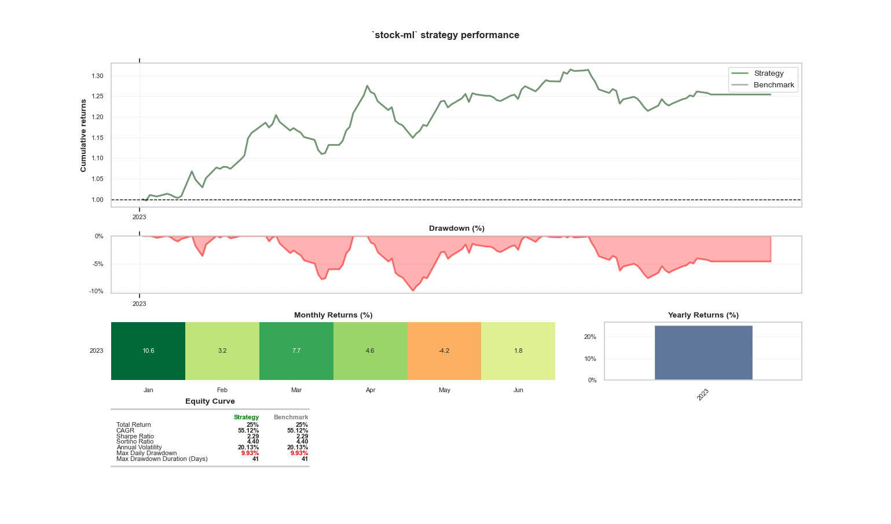

# stock-ml

End-to-End solution to:

1.  __quickly evaluate approaches__ to 
2. __maximize profits__ with 
3. __algorithmic trading__ 

By `evaluate` is not meant how correctly the machine-learning model predicts future, but rather how much money does it make:

>_It's not whether you're right or wrong that's important, but how much money you make when you're right and how much you lose when you're wrong._
>> (WARREN BUFFET or GEORGE SOROS)


## Why

Efficient workflow and reproducibility are extremely important in every machine learning projects, because they allow:
* quickly iterate on new approaches (trading strategies or machine models) and compare the results faster
* gain confidence in the results using backtests
* save time and resources


## How

The `core` of the tool is built with machine learning models for stock data prediction. The whole system however consists also of other, not less important parts:

* ~~data ingestion~~ (partially manual process: see `notebooks\data_load.ipynb`)
* data transformation (⚙)
* features selection (⚙)
* machine learning model selection (⚙)
* machine learning model training
* stock trading strategy evaluation
* ~~deployment and maintenance~~ (not part of this project)

(⚙) - these parts are easily configurable and interchangeable using a Dependency Injection framework

## What

`python src/experiment.py`

The main starting point of the system. It uses: 
* configurable (see: [Hydra](https://hydra.cc/docs/intro/)) pipelines & transformers to process data into the features for ML model.
  * some of the feature transformations use indicators implemented in [TA-Lib](https://ta-lib.org/) Technical Analysis Library
* training of ML-models ([scikit-learn](https://scikit-learn.org/stable/supervised_learning.html#supervised-learning) and [LightGBM](https://lightgbm.readthedocs.io/en/v3.3.2/))
  * with cross validation using `scikit-learn`'s [TimeSeriesSplit](https://scikit-learn.org/stable/modules/generated/sklearn.model_selection.TimeSeriesSplit.html), to split time series data into intervals (see [here](https://scikit-learn.org/stable/modules/cross_validation.html#time-series-split))
* trading strategy 
  * scanning all the available stocks and selecting the most promising ones, according to the implemented strategy
  * re-allocating portfolio according to the selected stocks and their weight-allocations
  * 📌 with custom risk model
  * backtested with customized experiments, based on [QSTrader](https://www.quantstart.com/qstrader/)

  Here's a sample result:
  


## Setup

HINT: the setup needs to be better tested - with different versions of Python and associated libraries, with their own dependencies.
The quick way of setting up that `should` work:
```
python -m pip install -r ./requirements.txt
```

Sometimes it needs to be installed manually:
```
conda create --name sml39 python=3.9
conda activate sml39
conda install ipython jupyterlab

python -m pip install -r ./requirements.txt
conda install pytables
conda install -c conda-forge yfinance 
conda install -c conda-forge lightgbm=3.2.1
pip install pillow==9.0.0
```

## Data

In order to successfully make this project running, one needs to provide your own data from a data provider of your choice, and make it available e.g. in HDF5 format, possibly updating the `config.yaml`. The attached `notebooks\data_load.ipynb` might be of help here.

The reason this data was not included in this repository is trivial: I would prefer to avoid lawsuits.


## References

1. Stefan Jansen: Machine Learning for Algorithmic Trading - Second Edition (highly recommended book, available e.g. [here](https://www.packtpub.com/product/machine-learning-for-algorithmic-trading-second-edition/9781839217715) ) and associated [github](https://github.com/stefan-jansen/machine-learning-for-trading) repository. Highly recommended.

2. [QSTrader](https://www.quantstart.com/qstrader/) - backtesting library of my choice. It allows rapid prototyping and performance statistics for results analysis.
